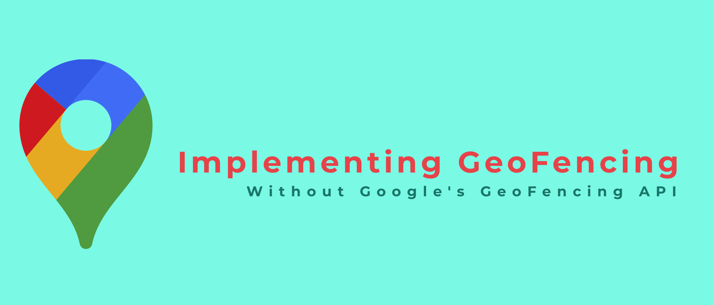
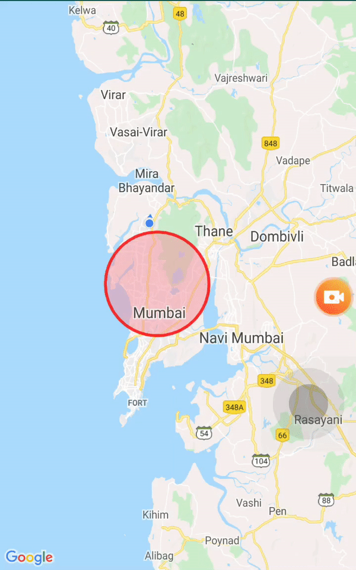

# Sample App with Custom GeoFencing Business Logic

This application gives an example of implementing a geofencing functionality without using Google Geofencing API. The business logic to calculate whether the user is in the desired zone or not, is currently on the front end. This business logic will be eventually moved to back end in future update.

Check out [this](https://medium.com/@kunalchaubal/implementing-geofencing-without-googles-geofencing-api-cc29b380c7c9) article which explains this functionality in detail

#### Framework used for dependency injection: [Koin](https://github.com/InsertKoinIO/koin)

